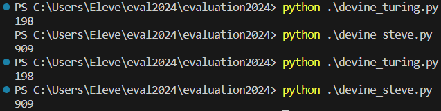

# Projet de Test - Fonctions de Dévination

## Informations personnelles
- **Nom et Prénom:** [SINGLAN Yohann]
- **Version:** [V1]
- **Date:** [15/01/2024]

## Tests Unitaires

### Fonction decomposer()
- Tâches réalisées: [Essai avec 2 suites de chiffres : 123 et 999]
- Résultat des tests: Aucune erreur détectée.

### Fonction divisible()
- Tâches réalisées: [Essai avec 81 & 100]
- Résultat des tests: Aucune erreur détectée.

### Fonction somme()
- Tâches réalisées: [Essai avec 123 ; 5 5 10 ; 000 ]
- Résultat des tests: Erreur sur cette fonction.

### Version de Turing
- Tâches réalisées: [Test unitaire effectué sur les différentes fonctions.]
- Résultat des tests: Erreur au niveau de la fonction "somme".

### Version de Steve
- Tâches réalisées: [Test unitaire effectué sur les différentes fonctions.]
- Résultat des tests: Erreur au niveau de la fonction "somme".

## Couverture de Test
- **Couverture Totale:** [75%]

**Essai des version de Turing & Steve :**

